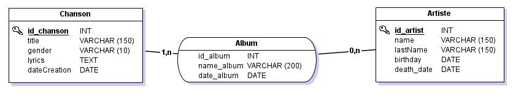

# Karaoke

## Description
This application is a karaoke back-end application, it is designed to manage storage and information about the artist and the song. you can easily find all the recordings of the artists. and you can add a song yourself

## Feature

The implementation of database is [here](./karaoke/doc/Karak's%20.mcd)

And here is the `database modelization`



If you need more information ,we have the API [here](./karaoke/doc/api.yaml)

## Getting Started
you just need to run the `KaraokeApplication.java`

And after that run in your browser `http://localhost:8080/chanson`

```sh

http://localhost:8080/chanson

```